# EffectTalk Architecture Documentation

> **Comprehensive architectural overview of the EffectTalk monorepo with dependency flows and system boundaries**

---

## 🏗️ Overview

EffectTalk is a unified, Effect-native monorepo for building AI-powered applications. The architecture follows strict layering principles with downward dependencies only, ensuring clean separation of concerns and maintainable code.

### Core Architectural Principles

1. **Strict Layering** - Layer 2 (McLuhan) can depend on Layer 1 (Hume), never the reverse
2. **Functional Effects** - All async operations use Effect.js for composability
3. **Type Safety** - Strict TypeScript with compile-time guarantees
4. **Package Isolation** - Each package is self-contained with package-relative imports
5. **Service Pattern** - All services use Effect.Service with dependency injection

---

## 📊 Architecture Diagram


---

## 🏛️ Layer Architecture

### Layer 2: McLuhan (Agent Infrastructure)

**Purpose**: High-level AI agent capabilities and orchestration

| Package              | Function                           | Dependencies                    | Key Features                               |
| -------------------- | ---------------------------------- | ------------------------------- | ------------------------------------------ |
| `effect-supermemory` | Long-term memory & semantic search | Layer 1: JSON, ENV              | Vector search, memory management           |
| `effect-ai-sdk`      | Multi-provider LLM integration     | None (independent)              | 8+ providers, streaming, structured output |
| `effect-cli-tui`     | Terminal UI & interactive prompts  | Layer 1: Supermemory, ENV, JSON | Prompts, tables, spinners, panels          |
| `effect-actor`       | State machine orchestration        | None (independent)              | Statecharts, workflow management           |
| `effect-cockpit`     | Agent dashboard & monitoring       | Layer 2 packages                | Monitoring, control interfaces             |

**Dependency Rules:**

- ✅ Can depend on Layer 1 packages
- ✅ Can depend on other Layer 2 packages (with restrictions)
- ❌ Cannot be imported by Layer 1 packages

### Layer 1: Hume (Data Foundation)

**Purpose**: Core data processing, validation, and external integrations

#### Resources Layer (Zero External Dependencies)

- `effect-json` - Type-safe JSON parsing with multiple backends
- `effect-env` - Environment variable validation and management
- `effect-regex` - Composable pattern matching and validation
- `effect-schema-utils` - Effect.Schema helpers and utilities

#### Content Layer (Format Processing)

- **Structured**: `effect-yaml`, `effect-xml`, `effect-csv`, `effect-toml`
- **Documents**: `effect-mdx`, `effect-html`, `effect-pdf`
- **Templates**: `effect-liquid` (Shopify Liquid engine)
- **Media**: `effect-xmp` (metadata extraction)

#### AI Integration Layer

- `effect-prompt` - Prompt management and templating
- `effect-models` - LLM model integration (OpenRouter, HuggingFace)

#### Services Layer (External Integration)

- `effect-repository` - Git operations and repository management
- `effect-artifact` - Artifact extraction and versioning
- `effect-attachment` - File attachment handling
- `effect-storage` - File system operations
- `effect-telemetry` - Observability and metrics collection

**Dependency Rules:**

- ✅ Can depend on other Layer 1 packages
- ✅ Can depend on Effect.js core
- ❌ Cannot depend on Layer 2 packages

---

## 🔄 Data Flow Patterns

### 1. Agent Execution Flow

```mermaid
sequenceDiagram
    participant App as Application
    participant Actor as effect-actor
    participant AI as effect-ai-sdk
    participant Memory as effect-supermemory
    participant Data as Layer 1 Packages

    App->>Actor: Start Workflow
    Actor->>Memory: Retrieve Context
    Memory->>Data: Parse/Validate Data
    Data-->>Memory: Processed Data
    Memory-->>Actor: Context Data
    Actor->>AI: Generate Response
    AI-->>Actor: LLM Response
    Actor->>Memory: Store Interaction
    Memory->>Data: Persist Data
    Actor-->>App: Workflow Result
```

### 2. CLI/TUI Interaction Flow


### 3. Data Processing Pipeline


---

## 🛡️ Architectural Boundaries

### Dependency Enforcement

```mermaid
graph LR
    subgraph "Allowed Dependencies"
        L2[Layer 2] --> L1[Layer 1]
        L2 --> L2_Other[Layer 2 Packages]
        L1 --> L1_Other[Layer 1 Packages]
        L1 --> EFFECT[Effect.js]
    end

    subgraph "Forbidden Dependencies"
        L1_X[Layer 1] -.->|❌ Forbidden| L2_X[Layer 2]
        L1_Y[Layer 1] -.->|❌ Forbidden| MONOPORE[Monorepo @/ paths]
    end

    style L2 fill:#f3e5f5,stroke:#4a148c
    style L1 fill:#e8f5e8,stroke:#1b5e20
    style EFFECT fill:#fff3e0,stroke:#e65100
```



### Package Isolation Rules

1. **Import Boundaries**
   - ✅ Package-relative imports: `./service.js`, `../types/index.js`
   - ❌ Monorepo absolute imports: `@/package-name/service.js`
   - ✅ External packages: `effect`, `@effect/platform`

2. **Service Boundaries**
   - Each package defines its own services
   - Services use Effect.Service pattern
   - No cross-package service dependencies (except through layers)

3. **Type Boundaries**
   - Public APIs exported through `index.ts`
   - Internal types kept in `types.ts`
   - No circular dependencies between packages

---

## 🔧 Implementation Patterns

### Service Pattern

```typescript
// Universal service pattern across all packages
export class MyService extends Effect.Service<MyService>()("MyService", {
  effect: Effect.fn(function* (config: ConfigType) {
    // Initialization runs once at layer construction
    return {
      operation: (input: Input) =>
        Effect.gen(function* () {
          // Implementation with proper error handling
          return yield* processInput(input);
        }),
    } satisfies MyServiceApi;
  }),
}) {}

// Layer creation for dependency injection
export const MyServiceDefault = MyService.Default({
  /* configuration */
});
```

### Error Pattern

```typescript
// Consistent error handling across layers
export class MyError extends Data.TaggedError("MyError")<{
  readonly message: string;
  readonly context?: Record<string, unknown>;
  readonly cause?: Error;
}> {}

// Type-safe error catching
someEffect.pipe(
  Effect.catchTag("MyError", (error) => {
    // error has typed fields available
    return fallback;
  }),
);
```

### Import Pattern

```typescript
// Standard import organization
import { Effect, Schema, Layer } from "effect";

// Package-relative imports only
import { MyService } from "./service.js";
import { Types } from "../types/index.js";
import { Utils } from "./utils/helpers.js";

// Type-only imports
import type { Config } from "./config.js";
```

---

## 📈 Scalability Considerations

### Horizontal Scaling

- **Package Independence**: Each package can be developed and deployed independently
- **Service Isolation**: Services don't share state, enabling horizontal scaling
- **Effect Composition**: Natural parallelization with Effect.all()

### Vertical Scaling

- **Resource Management**: Effect.js provides resource management and cleanup
- **Memory Efficiency**: Lazy evaluation prevents unnecessary computation
- **Error Boundaries**: Isolated error handling prevents cascade failures

### Extension Points

- **New Packages**: Can be added to either layer following dependency rules
- **Plugin Architecture**: Services can be swapped through layer composition
- **Protocol Extensions**: New data formats can be added to Layer 1

---

## 🔍 Monitoring & Observability

### Service-Level Monitoring


### Health Check Patterns

```typescript
// Health check service for monitoring
export class HealthService extends Effect.Service<HealthService>()(
  "HealthService",
  {
    effect: Effect.gen(function* () {
      return {
        checkAll: () =>
          Effect.gen(function* () {
            const checks = yield* Effect.all([
              checkDependencies(),
              checkResources(),
              checkExternalServices(),
            ]);

            return {
              status: checks.every((c) => c.healthy) ? "healthy" : "degraded",
              checks,
              timestamp: new Date().toISOString(),
            };
          }),
      };
    }),
  },
) {}
```

---

## 🚀 Deployment Architecture

### Development Environment


### Production Deployment


---

## 📚 Architecture Evolution

### Current State (v0.5.0-beta)

- ✅ **28 packages** with strict layering
- ✅ **Package-relative imports** for build reliability
- ✅ **Effect.Service pattern** across all packages
- ✅ **Type-safe error handling** with discriminated unions
- ✅ **85%+ test coverage** with real implementations

### Future Roadmap

#### v0.6.0 - Enhanced Capabilities

- [ ] **Persistent Memory Store** - PostgreSQL backend for effect-supermemory
- [ ] **Advanced Workflows** - Complex multi-agent orchestration
- [ ] **Real-time Streaming** - Live data processing capabilities
- [ ] **Enhanced Monitoring** - Advanced observability features

#### v1.0.0 - Production Ready

- [ ] **Visual Workflow Builder** - No-code agent creation
- [ ] **Agent Marketplace** - Shareable agent templates
- [ ] **Performance Optimizations** - Caching and optimization layers
- [ ] **Production Hardening** - Security and reliability improvements

---

## 🎯 Key Architectural Decisions

### 1. Strict Layering

**Decision**: Enforce downward dependencies only (Layer 2 → Layer 1)
**Rationale**: Prevents circular dependencies and maintains clear architectural boundaries
**Impact**: Enables independent development and testing of layers

### 2. Effect.js Foundation

**Decision**: Use Effect.js for all async operations and dependency injection
**Rationale**: Provides composability, type safety, and error handling consistency
**Impact**: Unified patterns across all packages and reliable error propagation

### 3. Package-Relative Imports

**Decision**: Use `./` and `../` paths instead of monorepo `@/` paths
**Rationale**: Ensures package isolation and build reliability
**Impact**: Self-contained packages that can be published independently

### 4. No Mocking Policy

**Decision**: Tests use real implementations, no mocks or stubs
**Rationale**: Accurate testing of real behavior and integration
**Impact**: Higher confidence in production behavior

### 5. Service Pattern Standardization

**Decision**: All services use Effect.Service with Effect.fn() parameterization
**Rationale**: Consistent dependency injection and configuration patterns
**Impact**: Predictable service behavior and easy composition

---

## 🔗 Related Documentation

- **[README.md](README.md)** - Project overview and quick start
- **[AGENTS.md](AGENTS.md)** - Comprehensive agent development guide
- **[CLAUDE.md](CLAUDE.md)** - Development patterns and coding standards
- **[CONTRIBUTING.md](CONTRIBUTING.md)** - Contribution guidelines and workflow

---

**Status:** ✅ Active Development  
**Last Updated:** January 2026  
**Repository:** https://github.com/PaulJPhilp/EffectTalk

---

Built with ❤️ for scalable AI agent architectures.
