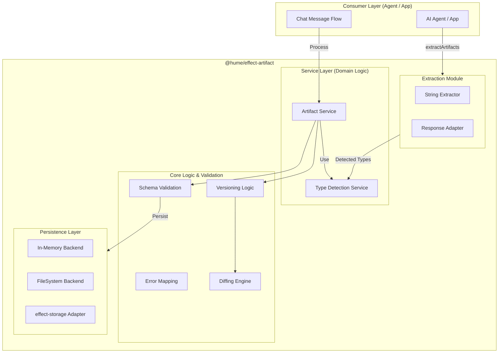

# effect-artifact Architecture

This document describes the internal architecture of `effect-artifact`, highlighting its layered design and integration with the Effect-TS ecosystem.

## 1. Overview

`effect-artifact` follows a strictly modular architecture, separating the concerns of content parsing (extraction), type classification, and asset management.

## 2. Key Components

### 2.1. Extraction Module
This module contains pure functions for parsing raw text (typically AI responses). It uses optimized regex patterns to identify:
- **Markdown Code Blocks:** Extracts code and language hints.
- **Diagrams:** Detects Mermaid, SVG, and other visual blocks.
- **Data:** Identifies JSON, YAML, etc.

### 2.2. Type Detection Service
A specialized service that analyzes content to determine its category and sub-type.
- **Heuristics:** Uses syntax patterns to identify programming languages.
- **MIME Mapping:** Maps file extensions and media types.

### 2.3. Artifact Service
The main orchestrator. It coordinates:
- **Creation:** Validating content, detecting type, and assigning initial version.
- **Updates:** Incrementing versions and maintaining parent links.
- **History:** Retrieving the chain of versions for an asset.

### 2.4. Persistence Layer
Supports pluggable backends:
- **InMemory:** Uses a standard JS `Map` for ephemeral storage.
- **FileSystem:** (In Progress) Uses standard Node/Bun filesystem APIs via `@effect/platform`.

## 3. Data Flow: The Ingest Pipeline

1. **Input:** Raw string from AI response.
2. **Extraction:** `extractArtifactsFromString` identifies candidate blocks.
3. **Detection:** `TypeDetectionService` assigns a category (e.g., `code`) and language (e.g., `typescript`) to each block.
4. **Validation:** `Schema.decode` ensures each extracted artifact matches the `Artifact` schema.
5. **Persistence:** `ArtifactService.create` saves the artifact to the configured backend.

## 4. Error Handling Strategy

All errors are modeled as `Data.TaggedError` types:
- `ArtifactNotFoundError`: When a requested ID or version doesn't exist.
- `ArtifactValidationError`: When content or metadata fails schema validation.
- `ArtifactStorageError`: When the underlying persistence layer fails (e.g., disk full).
- `InvalidArtifactTypeError`: When an unsupported type is requested.

## 5. Future Evolution: Location Transparency

In future versions, the persistence layer will be extended to support remote cloud storage (GCS/S3) while maintaining the same `ArtifactService` API. This allows developers to switch from local prototyping to cloud production by simply swapping the Effect Layer.
